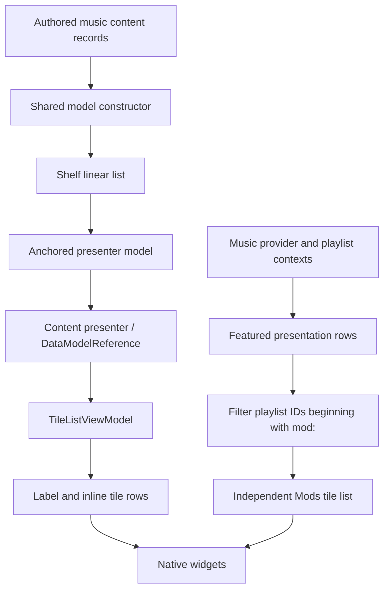

# Modding the native Music Playlist Manager

This guide explains how ReSkate adds a **Mods** shelf above Featured in skate.'s
existing Music Playlist Manager. It is a worked example of changing native UI
through its data models, while reusing the game's layout, playlist tiles and
selection behavior.

The shelf hook and model management live in [local_music_shelf.cpp](../Extension/Music/local_music_shelf.cpp).
The playlist and song UI publication remains in [local_music_ui.cpp](../Extension/Music/local_music_ui.cpp).
These are C++ runtime changes. A music mod can supply playlists through the
existing music-mod pipeline; adding a new native shelf requires runtime code
such as this hook. There is no general declarative UI-mod API established here.

## Evidence and version boundary

The loader addresses below are **CONFIRMED by disassembly** for Skate.exe SHA256
`fbce74d5e28ef525dbba2cb4adbebc13405bdbd88f31bc940bca45e4ae88b8f9`.
Addresses use preferred image base `0x140000000`; runtime code uses the loaded
base plus an RVA. Schema sizes and field paths were checked against authored
type metadata and live UI dumps on that build.

The independent Mods shelf and its position above Featured were **confirmed by
the user's in-game observation** on the personal development build. That is
distinct from compiling the isolated upstream-based PR branch. It does not
establish compatibility with a different executable or every native screen.

## Three layers to keep separate

**Authored assets describe the screen.** The music content-resource asset contains
named records for its shelves. Type-info assets describe the structures and their
fields. These records are templates and references, rather than live widgets.

**Runtime models hold the current values.** A model manager instantiates typed
values and assigns handles. The music provider publishes playlist/song data into
its contexts. The native UI also has presentation models: lists, labels,
presenters and tile rows. A playlist model and its visible tile are different
objects.

**Widgets consume presentation models.** A presenter binds a model to an authored
widget. Updating a value and creating a new visible widget are therefore separate
events. For this screen, adding a shelf after binding changed the array count
without producing the fourth rendered shelf. Inserting it before binding worked.
That observation is specific to the shelf list; do not assume all native lists
have identical behavior.



## Finding the right model

A schema hash identifies a **type**, not a particular screen instance. Many
screens use `linear_list`, and several lists can contain three anchored
presenters. Matching only a schema and count was insufficient.

The music hook first checks for a `linear_list`, then requires three 16-byte
entries with these exact authored record names, in this order:

```text
MusicPlaylistManager_Base_ContentResources/Featured_AnchoredContent_VM
MusicPlaylistManager_Base_ContentResources/Liked_AnchoredContent_VM
MusicPlaylistManager_Base_ContentResources/NewlyDiscovered_AnchoredContent_VM
```

Record identity is available earlier than every nested runtime binding. An early
attempt to identify the list by traversing its rendered titles did not complete.
Checking the authored names allowed the constructor-time insertion to fire.
The precise cause of that failed title traversal was not established.

### Types encountered in the shelf

| Type or role | Schema hash | Size on the tested build |
| --- | --- | ---: |
| PageViewModel | `0x5844be65` | 1968 bytes |
| Shelf `linear_list` | `0x48455d84` | 464 bytes |
| DataModelReference | `0x62088281` | 16 bytes |
| AnchoredContentPresenterViewModel | `0x0e3be640` | 192 bytes |
| ContentPresenter | `0x395d20a4` | 24 bytes |
| TileListViewModel | `0x74b1ea1d` | 392 bytes |
| Inline playlist tile row | `0xdeb20e0f` | 1200 bytes |
| Playlist data model | `0x63ddd270` | Resolve its fields through metadata |

The shelf list and the tile list both expose `ListItems`, hash `0x67223da7`, but
their element types differ. Shelf elements are 16-byte references. Playlist tile
elements are complete 1200-byte inline structures. Treating every `ListItems`
array as an array of handles corrupts the interpretation.

### Records, handles and references

The helper API represents a DataModelReference as:

```cpp
struct Ref {
    std::uintptr_t record; // authored record pointer, +0x00
    std::uint64_t handle;  // runtime ValueContext, +0x08
};
```

A record pointer and a model handle are different forms of identity. A handle is
not a memory address; resolve its type and storage through the model manager.
On the verified loader at `0x141918520` (RVA `0x1918520`), a named record supplies
its type at `+0x18` and typed data at `+0x20`. The UI dumper also reads its name
from `+0x28`.

The outer shelf reference points to an anchored model. Within that model:

```text
AnchoredContentPresenterViewModel
  -> field 0x214d4984
  -> field 0x25e4d6c8 : DataModelReference
       record +0x00
       ValueContext +0x08 : TileListViewModel handle
```

The tile-list title is a separate nested value:

```text
TileListViewModel
  -> CommonListData 0xfaec2d05
  -> label field   0xcb79482d
  -> text field    0x4d8e01b9
```

Use field metadata to obtain offsets and types. These hashes were recovered from
the imported type-info assets: `FieldNameHash` in authored values corresponds to
`NameHash` in field metadata. They are not names to recover by assuming an
ordinary string-hash algorithm. Type schema hashes form another lookup concern.

## Why the constructor hook matters

Hooking the public model-create wrapper did not reveal the authored music list.
The two creation paths meet lower down:

```text
models.create wrapper: 0x141918860
  calls shared constructor at 0x141918a1e

authored record loader: 0x141918520
  calls shared constructor at 0x14191868f

shared constructor: 0x141912670 (RVA 0x1912670)
```

**CONFIRMED:** the authored loader bypasses `models.create` while still using the
shared constructor. Absence from a wrapper hook did not mean the model was never
created.

The verified shared-constructor signature is:

```cpp
std::uint64_t construct(
    std::uintptr_t manager,
    std::uint8_t mode,
    std::uint64_t id,
    std::uintptr_t type,
    bool flag,
    std::uintptr_t record);
```

The shelf hook calls the original constructor first. On its return, it recognizes
the exact music list and inserts the new entry before the native caller continues
to bind widgets. It returns the original handle unchanged. Installation checks
an exact 32-byte executable fingerprint; a mismatch leaves this hook uninstalled.
See [local_music_shelf.h](../Extension/Music/local_music_shelf.h) for the contract and
[local_profile_runtime.cpp](../Extension/Profile/local_profile_runtime.cpp) for
installation. That profile-runtime change only installs the music hook; it does
not change cosmetic ownership or progression.

## Building an independent shelf

The successful duplicate experiment cloned Liked's anchored presenter with a new
handle. That rendered a fourth shelf, but still referenced Liked's tile list.
Cloning only the outer presenter does not make its contents independent.

The Mods implementation performs these steps under the native model write lock:

1. Read the original three shelf entries and retain the Featured anchor as the
   source of native playlist rows.
2. Create an anchored model and copy Liked's anchored template into it.
3. Create a separate TileListViewModel and copy Liked's tile-list template.
   Use resolved runtime data if available, otherwise verified authored record
   data of the expected type.
4. Publish the new title text, `Mods`, through the nested label field.
5. Clear the new tile array. Retarget the new anchor's presenter reference to
   `{record = 0, handle = new_tiles.handle}`.
6. Insert the new outer shelf reference at index zero. The result is
   **Mods, Featured, Liked, Newly Discovered**.
7. Populate the owned tile list from mod playlist rows in Featured.

The shelf is only built when an enabled mod declares a playlist with songs, read from
each mod's `reskate-music.json`. The insertion has to happen before the widgets bind,
so its rows cannot be awaited; the enabled mods' declarations are the signal that does
not depend on row hydration. With none, the native three shelves are left untouched
rather than publishing an empty Mods shelf.

The native template supplies layout and presentation defaults. Creating both
models separately supplies independent state. Changing the label on the original
Liked tile list would rename the original shelf too.

## Keeping the native tile behavior

A row contains more than its visible title. It carries nested presentation data
and references used by native behavior. Rather than inventing a replacement row,
the implementation copies the existing Featured rows for mod playlists.

The tested inline path to the row's tile-model reference is:

```text
row 0xdeb20e0f
  -> 0x214d4984
  -> 0x0fb0d794
  -> 0xa704272a
  -> 0xc52416ef
  -> 0x0abf7c31 : DataModelReference
```

Resolve that reference's runtime handle, then read field `0xeb4f9b4c` to obtain
the playlist handle. Playlist field `0xa5b84b8a` contains its identifier. Rows
whose identifiers start with `mod:` are included in Mods. The native copies
retain the existing actions and artwork references; filtering does not create
new playlist identities or replace the music provider.

The client update path polls every 250 ms because Featured presentation rows may
be hydrated after shelf construction. It follows the captured Featured anchor,
checks the current music provider's model manager, and republishes only when the
filtered row bytes or destination count change. A cached copy of source row bytes
avoids repeatedly publishing merely because native copying changes storage.

This adds a presentation shelf. Mod playlists can still appear in Featured;
the implementation does not remove them there or write them into Liked and Newly
Discovered.

## Mutation and ownership

Use [menu_data::Context](../Extension/UI/NativeMenu/native_menu_data.h) on the
client thread while holding `game::ModelWriteLock`. Its helpers validate model
types, resolve field metadata, and publish through native model operations.

| Helper | Purpose |
| --- | --- |
| `type_of`, `address` | Resolve a handle and validate live typed storage |
| `member` | Read a field's metadata, including its offset and type |
| `field`, `path` | Resolve native handles for fields being read or published |
| `create`, `copy` | Create an owned root and copy a typed template |
| `text`, `set`, `array` | Publish native values rather than assign raw pointers |
| `destroy` | Release an owned root, with type/expiration checks |

`Context::array` reads the element stride from the array's metadata and checks
that byte length matches element count. Its write helper builds the native array
header and performs synchronous typed publication. Native copying handles strings,
delegates, references and nested arrays; a borrowed pointer into a temporary
`std::vector` must not be installed as persistent model storage.

Raw traversal is useful for inspecting inline values before nested field handles
are available. The Mods hook uses metadata offsets for those reads. It still
uses native publication for writes. A raw memory snapshot containing pointers is
not a self-contained owned model.

Handle lifetime also matters. The implementation releases newly created roots
if template preparation fails and releases its previous owned anchor/tile roots
when replacing its tracked generation in the same manager. Reopening and switching
screens must be tested: a valid handle from one observation is not proof of its
validity after scene teardown.

The Mods shelf participates in the existing pre-level-transition callback. Before
leaving a level/sublevel or shutting down, it removes its anchor from the native
shelf list, clears the anchor's tile binding, and destroys both owned roots while
their widget assets are still loaded. Construction and row polling are suspended
during loading and resume when the next world becomes active. Recreating the
screen also releases the previous generation, including partially built roots.
This addresses the observed stale widget-reference crash at `0x143DC5EAA` during
map unloading. The installed Release build was confirmed in game to resolve the
reported shelf-creation/map-switch reproduction; the lifetime tests separately
cover ownership and transition ordering.

## Inspecting a screen yourself

ReSkate's console exposes the live model dumper:

```text
ui dump roots
ui dump MusicPlaylistManager
ui dump 0x48455d84
ui dump 0x0e3be640
ui dump 0x74b1ea1d
ui dump 0x74b1ea1d 5
```

The last form schedules the dump after five seconds, allowing time to open the
screen. Output goes to the game's `logs` directory. Read
[native_menu_dump.cpp](../Extension/UI/NativeMenu/native_menu_dump.cpp) for the
walker and [console_commands.cpp](../Extension/Multiplayer/console_commands.cpp)
for command registration.

Start with roots, identify the presentation type, follow record and handle
references, and compare observations before and after opening the screen. The
dumper has depth, element and node limits; a truncated dump cannot prove that a
field or model is absent.

For a new native UI change, establish four separate results: the intended model
was identified, native publication changed its value, widgets displayed the
change, and user interaction still worked. Test reopening as well as first open.
For shelves, test empty contents, multiple mod playlists and controller navigation.
Those are useful future regression checks, not claims that every case has already
passed for this implementation.

## Lessons that transfer to other screens

Recognize the particular authored resource before touching shared UI types. Trace
all relevant creation paths rather than relying on a convenient wrapper. Check
when widgets bind before choosing a mutation point. Clone every layer that needs
independent state, preserve native rows when their behavior is useful, and publish
through the engine's typed operations.

The Mods shelf demonstrates those techniques on one screen and one executable
build. Other screens need their own identity checks, schemas, timing observations
and interaction tests.
